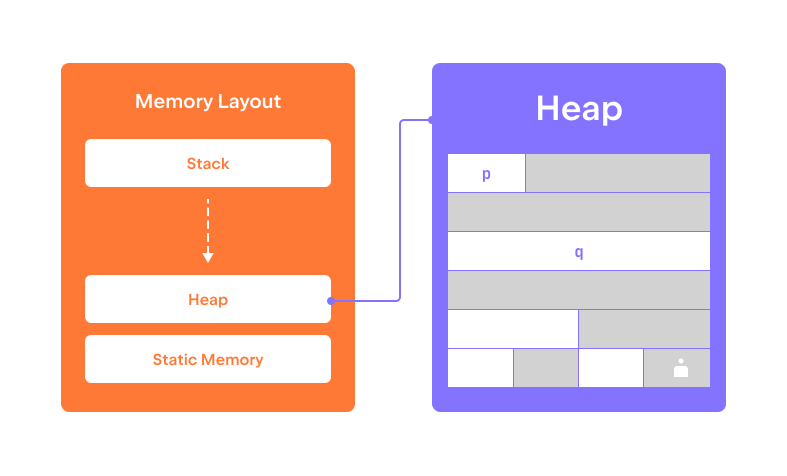

The dynamic memory region allows bypassing the limitations 
of static and stack memory regions.  
It allows us to manage the allocated memory _dynamically_ and _manually_, 
thus, making it possible, for example, to return 
the memory address of a variable allocated inside the function back to the caller.
This flexibility comes with a price – the programmer has to 
carefully track the dynamically allocated memory making sure that: 

* it is eventually deallocated (thus, avoiding the situation when the program runs out of memory), and
* once it is deallocated, the program never accesses it again (otherwise, it can crash or read garbage). 

The function `malloc` from the standard library is used to allocate a chunk of memory.
It takes the size of the memory chunk needed to allocate in bytes.

```c++
// allocates 8 bytes
char* p = (char*) malloc(8);
```

Note that `malloc` returns an _untyped_ `void*` pointer.
In order to cast it to a typed pointer `char*`, 
we use the __C style type cast operator__ `(char*)`. 
We will return back to type casts later in this module.

The allocated memory is __uninitialized__, and 
you have to manually initialize it before trying to read it.

```c++
for (int i = 0; i < 8; ++i) {
    p[i] = 0;
}
```

When allocating an array of variables of some type, 
a common idiom is to calculate the size of the needed memory chunk 
using the `sizeof` operator. 

```c++
// allocates 8 integers
int* q = (int*) malloc(8 * sizeof(int));
```

When the size passed to `malloc` is equal to `0`, the result is unspecified.
It may be a null pointer, but it also may be another non-null pointer –
dereferencing or deallocating this pointer is prohibited. 

```c++
// result is unspecified 
int* r = (int*) malloc(0);
```

To deallocate a previously allocated memory chunk, use the function `free`.
It takes a single argument – the pointer to the deallocated memory chunk.

```c++
free(p);
free(q);
```

It is very important to __deallocate__ memory once it is not needed anymore. 
Otherwise, it becomes wasted, and if you waste a large amount of memory, 
your program is at risk of running out of memory.

