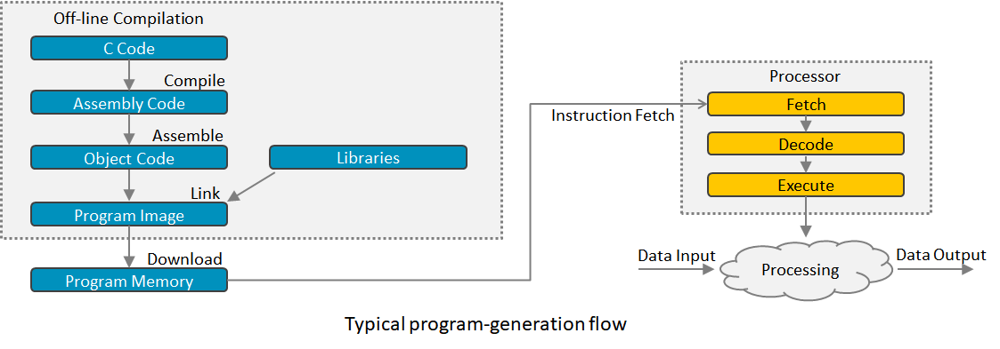

# The program generation flow

Building and running a C++ program is a multi-step process, that can be 
described as follows :
- First, the code is run through a preprocessor, which recognizes meta- 
  information about the code. The preprocessor may for instance perform a 
  textual replacement of symbols defined in the code, before compilation 
  applies.
- Next, the code is compiled, or translated into machine-readable object files.
- The individual object files are then linked together into a single 
  application.
- Finally, the generated executable file or program image is stored/downloaded 
  in the program memory - normally an on-chip flash memory -, to be fetched 
  by the processor.

This process is better described in the picture below:

In more details, the build process can be decomposed into the following stages:
- Preprocessor :
  - In C or C++, lines that begin with the hash-tag (#) contain commands for 
    the preprocessor.
  - The preprocessor processes all commands, like replacing macros, defined by 
    an initial hash-tag (#) in the code.
- Parser : 
  - Reads in C/C++ code.
  - Checks for syntax errors.
  - Forms intermediate code (tree representation).
- High-Level Optimizer: Modifies intermediate code (processor-independent)
- Code Generator
  - Creates assembly code step-by-step from each node of the intermediate code
  - Allocates variable uses to registers
- Low-Level Optimizer: Modifies assembly code (parts are processor-specific)
- Assembler: Creates object code (machine code)
- Linker/Loader: Creates executable image from object file